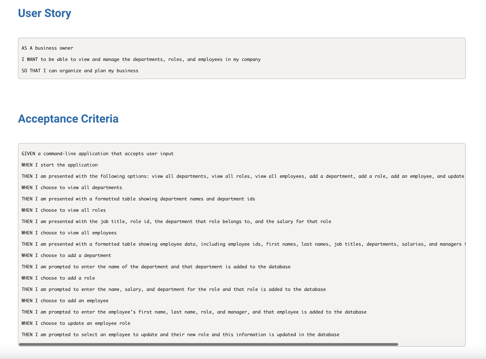

# SQL-Employee-Tracker

This week our assignment was to use sql to create an employee tracker. The 
program needs pg and inquirer in order to run the program as it will be needing 
to have functionality with the user being able to access the app within the terminal
using npm start.